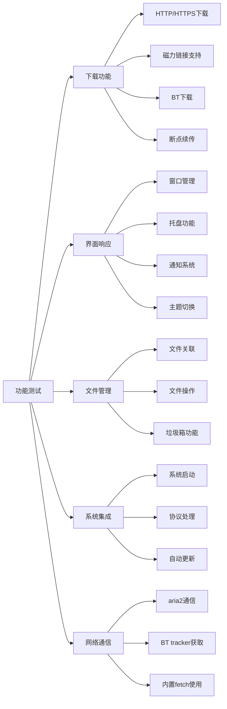

# Motrix Electron 升级计划：从 22.3.9 到 36.4.0

## 项目概况

- **当前版本**: Electron 22.3.9
- **目标版本**: Electron 36.4.0
- **跨越版本**: 14个主要版本（22 → 36）
- **项目特点**: 下载管理器，使用Vue 2 + electron-vue架构
- **升级原因**: 需要使用Electron 36中的新API功能，担心@electron/remote模块的兼容性

## 重要发现：内置fetch支持

### Node.js版本升级带来的变化

Electron 36.4.0 使用 **Node.js 20.18.1**，该版本内置了全局的 `fetch` API，这意味着：

1. **不再需要 `node-fetch` 依赖**
2. **可以移除 fetch polyfill 代码**
3. **简化依赖管理和减小包体积**

### 当前项目中的fetch使用情况

分析发现项目中有智能的fetch处理：

```javascript
// src/shared/aria2/lib/JSONRPCClient.js
import _fetch from 'node-fetch'
const fetch = global.fetch ? global.fetch.bind(global) : _fetch

// src/main/index.js  
import fetch from 'node-fetch'
if (!global.fetch) {
  global.fetch = fetch
}
```

这种设计已经为内置fetch做好了准备！

## 项目代码分析结果

### 关键发现

经过代码分析，发现以下重要信息：

1. **@electron/remote 使用情况**：
   - `src/main/index.js`: 初始化 `@electron/remote/main`
   - `src/main/Launcher.js`: 在每个窗口启用 remote
   - `src/renderer/utils/native.js`: 使用 `shell`, `nativeTheme` from `@electron/remote`

2. **安全配置问题**：
   - `src/main/ui/WindowManager.js` 中的 webPreferences 配置存在安全风险
   - `nodeIntegration: true` 和 `contextIsolation: false` 不符合现代安全标准

3. **API兼容性良好**：
   - 已经在使用 `nativeTheme` API（符合新版本要求）
   - 已经使用 `shell.trashItem()` 而非废弃的 `moveItemToTrash()`
   - 使用了 `setWindowOpenHandler()` 而非废弃的 `new-window` 事件

4. **智能的fetch处理**：✅ **重大优势**
   - 项目已经实现了fetch的向后兼容检测
   - 升级后可以直接移除 `node-fetch` 依赖

## 主要挑战分析

```mermaid
graph TD
    A[Electron 22.3.9] --> B[主要挑战识别]
    B --> C[@electron/remote兼容性]
    B --> D[安全策略升级]
    B --> E[构建工具升级]
    B --> F[依赖项兼容性]
    B --> G[fetch依赖清理]
    
    C --> C1[remote模块在渲染进程中使用]
    C --> C2[需要确保跨进程通信正常]
    
    D --> D1[webPreferences安全配置]
    D --> D2[contextIsolation启用]
    
    E --> E1[electron-builder升级]
    E --> E2[Webpack配置调整]
    
    F --> F1[puppeteer兼容性]
    F --> F2[其他依赖更新]
    
    G --> G1[移除node-fetch依赖]
    G --> G2[清理fetch polyfill代码]
```

## 详细升级计划

### 阶段1: 准备和兼容性评估（预计1-2天）

#### 1.1 环境准备
- [ ] 创建专门的升级分支 `upgrade/electron-36`
- [ ] 备份当前工作版本
- [ ] 设置测试环境
- [ ] 创建回滚计划

#### 1.2 依赖项兼容性检查
```json
{
  "需要升级的关键依赖": {
    "electron": "22.3.9 → 36.4.0",
    "electron-builder": "24.4.0 → latest",
    "@electron/remote": "2.0.9 → 验证兼容性",
    "electron-updater": "6.1.0 → latest", 
    "electron-store": "8.1.0 → latest",
    "electron-devtools-installer": "3.2.0 → latest",
    "puppeteer": "24.10.0 → 验证兼容性"
  },
  "可以移除的依赖": {
    "node-fetch": "2.7.0 → 移除（内置fetch替代）"
  }
}
```

#### 1.3 Node.js版本评估
- [ ] 确认Electron 36使用Node.js 20.18.1（内置fetch支持）
- [ ] 更新 `package.json` 中的engines字段为Node.js >= 18.0.0
- [ ] 验证开发环境Node.js版本

### 阶段2: 核心升级实施（预计2-3天）

#### 2.1 Electron核心升级
```bash
# 步骤1: 移除旧版本
yarn remove electron

# 步骤2: 安装新版本
yarn add --dev electron@36.4.0

# 步骤3: 验证安装和Node.js版本
npx electron --version
node -e "console.log('Node version:', process.versions.node)"
```

#### 2.2 关键依赖项升级
```bash
# electron-builder升级
yarn add --dev electron-builder@latest

# electron-updater升级  
yarn add --dev electron-updater@latest

# electron-store升级
yarn add --dev electron-store@latest

# electron-devtools-installer升级
yarn add --dev electron-devtools-installer@latest

# 验证@electron/remote兼容性
yarn list @electron/remote
```

#### 2.3 ⭐ **移除 node-fetch 依赖**
```bash
# 移除不再需要的node-fetch
yarn remove node-fetch

# 验证移除成功
yarn list node-fetch
```

#### 2.4 Node.js版本要求调整
```json
{
  "engines": {
    "node": ">=18.0.0"
  }
}
```

### 阶段3: fetch代码清理（预计1天）⭐ **新增阶段**

#### 3.1 清理fetch polyfill代码

**移除主进程中的fetch polyfill**：
```javascript
// src/main/index.js - 移除以下代码
import fetch from 'node-fetch'

// 添加fetch polyfill到全局对象
if (!global.fetch) {
  global.fetch = fetch
}
```

**更新为**：
```javascript
// src/main/index.js - 简化后的代码
// 移除node-fetch导入和polyfill代码
// Node.js 20.18.1 内置fetch支持
```

#### 3.2 更新JSONRPCClient

**当前代码**（`src/shared/aria2/lib/JSONRPCClient.js`）：
```javascript
// 当前的智能处理（保持不变，无需修改）
import _fetch from 'node-fetch'
const fetch = global.fetch ? global.fetch.bind(global) : _fetch
```

**升级后处理**：
```javascript
// 选项1: 完全移除node-fetch导入（推荐）
const fetch = global.fetch.bind(global)

// 选项2: 保持向后兼容（如果担心兼容性）
// 当前代码无需修改，但可以移除node-fetch导入
const fetch = global.fetch ? global.fetch.bind(global) : fetch
```

#### 3.3 验证fetch功能

- [ ] 确认aria2 JSON-RPC通信正常
- [ ] 验证HTTP请求功能
- [ ] 测试WebSocket连接
- [ ] 检查BT tracker获取功能

### 阶段4: 安全策略升级（预计2-3天）

#### 4.1 **重要**：webPreferences 安全配置修复

**当前存在的安全问题**（`src/main/ui/WindowManager.js`）：
```javascript
// 当前配置 - 存在安全风险
webPreferences: {
  enableRemoteModule: true,
  contextIsolation: false,      // 安全风险
  nodeIntegration: true,        // 安全风险
  nodeIntegrationInWorker: true // 安全风险
}
```

**推荐的安全配置**：
```javascript
// 新的安全配置
webPreferences: {
  nodeIntegration: false,
  contextIsolation: true,
  enableRemoteModule: true, // 仅在需要remote时保留
  preload: path.join(__dirname, 'preload.js'), // 需要创建preload脚本
  sandbox: false // 根据需要调整
}
```

#### 4.2 创建 Preload 脚本
需要创建 `src/main/preload.js` 来安全地暴露API：
```javascript
// src/main/preload.js
const { contextBridge, ipcRenderer } = require('electron')

// 安全地暴露API到渲染进程
contextBridge.exposeInMainWorld('electronAPI', {
  // 暴露需要的API
  showItemInFolder: (path) => ipcRenderer.invoke('show-item-in-folder', path),
  openItem: (path) => ipcRenderer.invoke('open-item', path),
  // 其他需要的API...
})
```

#### 4.3 调整渲染进程代码
修改 `src/renderer/utils/native.js` 以适应新的安全模型：
```javascript
// 如果启用contextIsolation，需要通过preload API访问
// 而不是直接使用 @electron/remote

// 选项1: 继续使用@electron/remote（需要contextIsolation: false）
// 选项2: 迁移到preload + IPC模式（推荐）
```

### 阶段5: API兼容性验证（预计1-2天）

#### 5.1 @electron/remote模块处理

**当前使用情况良好**：
- `src/main/index.js`: 正确初始化 `@electron/remote/main`
- `src/main/Launcher.js`: 正确启用每个窗口的 remote
- `src/renderer/utils/native.js`: 使用方式正确

**需要验证的功能**：
- [ ] `shell.showItemInFolder()` 功能
- [ ] `shell.openPath()` 功能  
- [ ] `shell.trashItem()` 功能
- [ ] `nativeTheme.shouldUseDarkColors` 功能

#### 5.2 已经兼容的API（无需修改）

以下API已经是推荐的新版本API：
- ✅ `nativeTheme.shouldUseDarkColors` (代替 `systemPreferences.isDarkMode()`)
- ✅ `shell.trashItem()` (代替 `shell.moveItemToTrash()`)
- ✅ `webContents.setWindowOpenHandler()` (代替 `new-window` 事件)
- ✅ `nativeTheme.on('updated')` 事件处理
- ✅ 智能fetch处理 (已为内置fetch做好准备)

#### 5.3 需要检查的潜在变更
- [ ] 确认没有使用已废弃的 `webContents` 导航API
- [ ] 验证 `electron-updater` 配置兼容性
- [ ] 检查 `electron-store` 配置

### 阶段6: 构建配置优化（预计1-2天）

#### 6.1 Webpack配置验证

**检查 `.electron-vue/webpack.main.config.js`**：
```javascript
// 确保target正确
module.exports = {
  target: 'electron-main',
  node: {
    __dirname: false,
    __filename: false
  },
  // 其他配置保持不变
}
```

**检查 `.electron-vue/webpack.renderer.config.js`**：
```javascript
// 如果启用contextIsolation，可能需要调整配置
module.exports = {
  target: 'electron-renderer',
  // 确保与新的安全策略兼容
}
```

#### 6.2 electron-builder配置验证

**检查 `electron-builder.json` 兼容性**：
```json
{
  "files": [
    "dist/electron/**/*",
    "node_modules/puppeteer/.local-chromium/**/*"  
  ],
  "asarUnpack": [
    "node_modules/puppeteer/.local-chromium/**/*"
  ]
}
```

可能需要调整：
- [ ] 构建目标架构配置
- [ ] Puppeteer兼容性（可能需要更新路径）
- [ ] 应用签名配置

### 阶段7: 测试和验证（预计2-3天）

#### 7.1 功能测试矩阵



#### 7.2 重点测试项目

**内置fetch功能测试**：⭐ **新增重点**
- [ ] aria2 JSON-RPC通信正常
- [ ] BT tracker列表获取功能
- [ ] HTTP请求响应正常
- [ ] 无 `node-fetch` 相关错误

**@electron/remote相关功能**：
- [ ] 文件夹显示：`shell.showItemInFolder()`
- [ ] 文件打开：`shell.openPath()`
- [ ] 文件删除：`shell.trashItem()`
- [ ] 主题检测：`nativeTheme.shouldUseDarkColors`

**下载管理核心功能**：
- [ ] HTTP/HTTPS下载
- [ ] 磁力链接下载  
- [ ] BT种子下载
- [ ] 断点续传
- [ ] 下载队列管理
- [ ] 下载进度显示

**系统集成功能**：
- [ ] 文件关联（.torrent文件）
- [ ] 协议处理（magnet、thunder、mo/motrix）
- [ ] 系统通知
- [ ] 托盘功能
- [ ] 自动启动

**安全功能验证**：
- [ ] 新的webPreferences配置正常工作
- [ ] 跨进程通信安全性
- [ ] 外部链接处理安全性

#### 7.3 兼容性测试
- [ ] Windows 10/11 (x64, ia32)
- [ ] macOS Intel (x64)
- [ ] macOS Apple Silicon (arm64)
- [ ] macOS Universal (universal)
- [ ] Linux (Ubuntu, CentOS等主要发行版)

#### 7.4 性能基准测试
- [ ] 应用启动时间对比
- [ ] 内存使用情况对比（预期减少，因为移除了node-fetch）
- [ ] 下载性能对比  
- [ ] CPU使用率对比

### 阶段8: 部署和发布（预计1天）

#### 8.1 版本更新
```json
{
  "version": "1.8.20",
  "description": "升级到Electron 36.4.0，使用内置fetch，改进性能和安全性"
}
```

#### 8.2 发布说明准备
**升级亮点**：
- 升级到Electron 36.4.0，获得最新安全更新
- **使用内置fetch API，移除node-fetch依赖，减小包体积**
- 增强应用安全性（contextIsolation等）
- 改进应用性能和稳定性
- 增强系统兼容性
- 现代化API支持

**性能改进**：
- 减小应用包体积（移除node-fetch依赖）
- 更快的网络请求（内置fetch性能更好）
- 减少内存占用

**安全改进**：
- 启用上下文隔离（contextIsolation）
- 禁用不安全的nodeIntegration
- 使用preload脚本安全暴露API

**兼容性说明**：
- 要求Node.js >= 18.0.0
- 保持所有现有功能完整性
- 向后兼容用户数据和设置

## 风险评估和缓解策略

```mermaid
graph TD
    A[风险评估] --> B[高风险]
    A --> C[中风险]
    A --> D[低风险]
    
    B --> B1[webPreferences安全配置变更]
    B --> B2[@electron/remote功能异常]
    
    C --> C1[fetch代码变更]
    C --> C2[构建配置失败]
    C --> C3[Puppeteer兼容性]
    
    D --> D1[UI细微变化]
    D --> D2[文档更新需求]
    
    B1 --> B1M[缓解：创建preload脚本或保持现有配置]
    B2 --> B2M[缓解：详细测试所有remote API调用]
    C1 --> C1M[缓解：智能fetch检测已存在，风险较低]
    C2 --> C2M[缓解：逐步升级，保留备份配置]
```

### 具体风险和缓解措施

**高风险项目**：

1. **webPreferences安全配置变更**
   - **风险**：启用contextIsolation可能破坏现有渲染进程代码
   - **缓解方案**：
     - 选项A：保持`contextIsolation: false`以确保兼容性
     - 选项B：创建preload脚本，逐步迁移到安全模式
     - 建议：先选择选项A确保功能正常，后续版本再迁移到选项B

2. **@electron/remote功能异常**
   - **风险**：remote模块可能在新版本中行为发生变化
   - **缓解方案**：详细测试所有remote API调用，准备IPC替代方案

**中风险项目**：

1. **fetch代码变更**⭐ **实际上是优势**
   - **风险**：移除node-fetch可能导致网络请求失败
   - **缓解方案**：项目已有智能fetch检测，风险极低
   - **预期结果**：性能提升和包体积减小

2. **Puppeteer兼容性**
   - **风险**：Puppeteer可能需要更新以支持新版本Electron
   - **缓解方案**：测试Puppeteer功能，必要时升级版本

## 分阶段实施建议

### 阶段一：保守升级（推荐先实施）
1. 升级Electron到36.4.0
2. 移除node-fetch依赖并清理fetch polyfill
3. 升级相关依赖项
4. 保持现有webPreferences配置不变
5. 验证所有功能正常

### 阶段二：安全增强（后续版本）
1. 创建preload脚本
2. 启用contextIsolation
3. 重构渲染进程代码使用IPC而非remote

## 预期收益

1. **安全性提升**: 获得14个版本的安全修复和补丁
2. **性能优化**: 
   - 新版本的渲染引擎和内存管理改进
   - **内置fetch性能更好，减小包体积**
   - 减少依赖项，提升启动速度
3. **API现代化**: 使用更稳定和高效的Electron API
4. **长期维护**: 保持与最新生态系统的兼容性
5. **新功能支持**: 获得访问Electron 36新功能的能力
6. **开发者体验**: 更好的调试工具和开发支持
7. **包体积减小**: 移除node-fetch依赖

## 时间估算

- **总预计时间**: 10-15个工作日
- **关键路径**: fetch代码清理和功能测试
- **并行任务**: 文档更新和发布准备

**详细时间分配**：
- 阶段1 (准备): 1-2天
- 阶段2 (核心升级): 2-3天  
- 阶段3 (fetch清理): 1天 ⭐ **新增优势**
- 阶段4 (安全升级): 2-3天
- 阶段5 (API验证): 1-2天
- 阶段6 (构建优化): 1-2天
- 阶段7 (测试验证): 2-3天
- 阶段8 (部署发布): 1天

## 成功标准

1. ✅ 所有核心功能正常工作（下载、界面、系统集成）
2. ✅ 通过所有平台兼容性测试
3. ✅ 性能指标不低于当前版本（预期有提升）
4. ✅ 构建和部署流程正常
5. ✅ 无严重安全漏洞或稳定性问题
6. ✅ @electron/remote模块正常工作
7. ✅ 自动更新机制正常
8. ✅ 文件操作功能（显示、打开、删除）正常
9. ✅ 主题切换功能正常
10. ✅ **内置fetch替代node-fetch成功，无网络通信问题**
11. ✅ **应用包体积减小**

## 实施检查清单

### 代码修改清单
- [ ] `package.json`: 更新electron版本，移除node-fetch，更新engines要求
- [ ] `src/main/index.js`: 移除node-fetch导入和fetch polyfill代码
- [ ] `src/shared/aria2/lib/JSONRPCClient.js`: 移除node-fetch导入（可选）
- [ ] `src/main/ui/WindowManager.js`: 检查webPreferences配置
- [ ] `.electron-vue/webpack.*.config.js`: 验证构建配置
- [ ] `electron-builder.json`: 验证打包配置

### 测试验证清单
- [ ] 应用启动和初始化
- [ ] **内置fetch功能正常（aria2通信、tracker获取）**
- [ ] @electron/remote功能（文件操作、主题检测）
- [ ] 下载功能完整性测试
- [ ] 系统集成功能测试
- [ ] 多平台兼容性测试
- [ ] 性能基准对比（预期有提升）
- [ ] 安全策略验证

### 部署准备清单
- [ ] 版本号更新
- [ ] 发布说明编写（突出fetch优化）
- [ ] 构建测试通过
- [ ] 包体积对比验证
- [ ] 回滚计划确认

---

**文档版本**: v3.0  
**创建日期**: 2025-06-08  
**最后更新**: 2025-06-08  
**负责人**: 开发团队

**重要更新**: 基于Node.js 20.18.1内置fetch支持，移除node-fetch依赖，优化性能和包体积