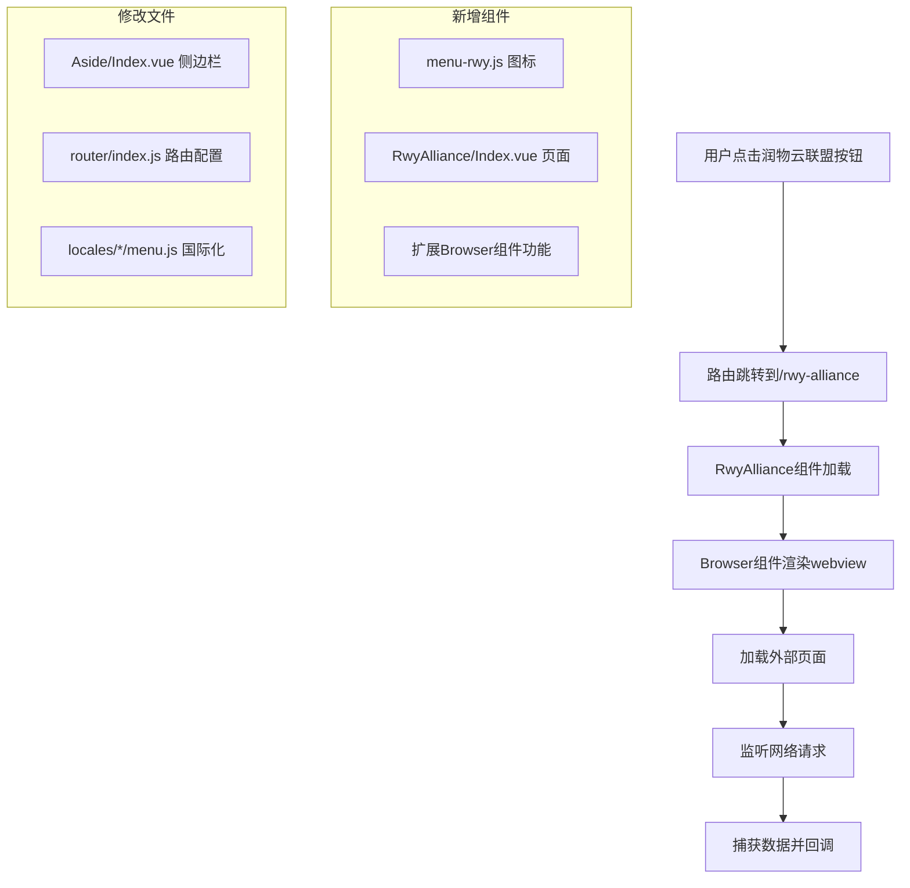

# 润物云联盟功能实施计划

## 项目概述

在Motrix应用的左侧侧边栏增加一个"润物云联盟"按钮，点击后切换到润物云联盟的素材页面（https://rwy.ywwl.com/lm/#/），并具备捕获页面请求数据的能力。

## 技术分析

### 现有架构分析

1. **侧边栏组件**: [`src/renderer/components/Aside/Index.vue`](src/renderer/components/Aside/Index.vue)
   - 包含上方菜单（任务、添加任务）和下方菜单（设置、关于）
   - 使用Vue Router进行页面导航

2. **路由系统**: [`src/renderer/router/index.js`](src/renderer/router/index.js)
   - 基于Vue Router实现单页面应用路由
   - 支持嵌套路由结构

3. **Webview组件**: [`src/renderer/components/Browser/index.vue`](src/renderer/components/Browser/index.vue)
   - 已有的webview实现，使用iframe技术
   - 支持加载状态管理和外部链接处理

4. **国际化支持**: [`src/shared/locales/zh-CN/menu.js`](src/shared/locales/zh-CN/menu.js)
   - 多语言支持架构完善
   - 支持动态语言切换

## 实施架构图



## 详细实施步骤

### 第一阶段：基础组件创建

#### 1. 创建润物云联盟图标
**文件**: `src/renderer/components/Icons/menu-rwy.js`
```javascript
// 基于现有图标组件模式创建
export default {
  name: 'menu-rwy',
  functional: true,
  render (h, { data }) {
    return h('svg', {
      ...data,
      attrs: {
        'fill': 'currentColor',
        'viewBox': '0 0 1024 1024',
        'width': '1em',
        'height': '1em'
      }
    }, [
      // SVG路径数据
    ])
  }
}
```

**对应SVG文件**: `src/renderer/assets/icons/menu-rwy.svg`

#### 2. 更新国际化配置
**修改文件**: `src/shared/locales/zh-CN/menu.js`
```javascript
export default {
  'app': 'Motrix',
  'file': '文件',
  'task': '任务',
  'edit': '编辑',
  'window': '窗口',
  'help': '帮助',
  'rwyAlliance': '润物云联盟'  // 新增
}
```

**需要更新的其他语言文件**:
- `src/shared/locales/en/menu.js` → `'rwyAlliance': 'RWY Alliance'`
- 其他所有语言目录下的menu.js文件

### 第二阶段：页面组件开发

#### 3. 创建润物云联盟页面组件
**新建文件**: `src/renderer/components/RwyAlliance/Index.vue`
```vue
<template>
  <el-main class="content main">
    <div class="panel">
      <div class="rwy-alliance-header">
        <h2>{{ $t('menu.rwyAlliance') }}</h2>
      </div>
      <mo-browser 
        ref="rwyBrowser"
        :src="rwyUrl"
        @request-captured="handleRequestData"
        class="rwy-browser"
      />
    </div>
  </el-main>
</template>

<script>
import Browser from '@/components/Browser'

export default {
  name: 'mo-rwy-alliance',
  components: {
    [Browser.name]: Browser
  },
  data() {
    return {
      rwyUrl: 'https://rwy.ywwl.com/lm/#/'
    }
  },
  methods: {
    handleRequestData(requestData) {
      // 处理捕获的请求数据
      console.log('捕获的请求数据:', requestData)
      // 可以在这里实现数据存储、处理等逻辑
    }
  }
}
</script>

<style lang="scss" scoped>
.rwy-alliance-header {
  padding: 20px 0;
  border-bottom: 1px solid #e0e0e0;
  margin-bottom: 20px;
  
  h2 {
    margin: 0;
    color: #333;
    font-size: 24px;
  }
}

.rwy-browser {
  height: calc(100vh - 180px);
  border: 1px solid #e0e0e0;
  border-radius: 4px;
}
</style>
```

### 第三阶段：Browser组件扩展

#### 4. 扩展Browser组件以支持请求监听
**修改文件**: `src/renderer/components/Browser/index.vue`

在现有组件基础上添加请求监听功能：

```javascript
// 在mounted方法中添加
mounted () {
  const { iframe } = this.$refs

  iframe.addEventListener('did-start-loading', this.loadStart.bind(this))
  iframe.addEventListener('did-stop-loading', this.loadStop.bind(this))
  iframe.addEventListener('dom-ready', this.ready.bind(this))
  
  // 新增：网络请求监听
  if (this.enableRequestCapture) {
    this.setupRequestInterception()
  }
},

methods: {
  // 新增方法
  setupRequestInterception() {
    const { iframe } = this.$refs
    const wc = webContents.fromId(iframe.getWebContentsId())
    
    // 监听所有网络请求
    wc.session.webRequest.onBeforeRequest((details, callback) => {
      // 发射请求数据到父组件
      this.$emit('request-captured', {
        url: details.url,
        method: details.method,
        timestamp: Date.now(),
        headers: details.requestHeaders
      })
      callback({})
    })
    
    // 监听响应
    wc.session.webRequest.onCompleted((details) => {
      this.$emit('response-captured', {
        url: details.url,
        statusCode: details.statusCode,
        responseHeaders: details.responseHeaders,
        timestamp: Date.now()
      })
    })
  }
}
```

添加新的props：
```javascript
props: {
  src: {
    type: String,
    default: ''
  },
  enableRequestCapture: {  // 新增
    type: Boolean,
    default: false
  }
}
```

### 第四阶段：路由配置

#### 5. 更新路由配置
**修改文件**: `src/renderer/router/index.js`

在children数组中添加新路由：
```javascript
{
  path: '/rwy-alliance',
  name: 'rwy-alliance',
  component: require('@/components/RwyAlliance/Index').default
}
```

### 第五阶段：侧边栏集成

#### 6. 更新侧边栏组件
**修改文件**: `src/renderer/components/Aside/Index.vue`

添加导入：
```javascript
import '@/components/Icons/menu-rwy'
```

在top-menu中添加新按钮：
```vue
<ul class="menu top-menu">
  <li @click="nav('/task')" class="non-draggable">
    <mo-icon name="menu-task" width="20" height="20" />
  </li>
  <li @click="nav('/task')" class="non-draggable">
    <mo-icon name="menu-add" width="20" height="20" />
  </li>
  <!-- 新增润物云联盟按钮 -->
  <li @click="nav('/rwy-alliance')" class="non-draggable">
    <mo-icon name="menu-rwy" width="20" height="20" />
  </li>
</ul>
```

## 技术特性

### 数据捕获能力

1. **请求拦截**: 通过Electron的webRequest API监听所有网络请求
2. **数据过滤**: 可以根据URL模式、请求类型等条件过滤需要的数据
3. **实时监听**: 支持实时捕获和处理请求数据
4. **双向通信**: 支持页面与主应用的数据交互

### 安全性考虑

1. **内容安全策略**: webview运行在沙箱环境中
2. **权限控制**: 限制webview的API访问权限
3. **数据验证**: 对捕获的数据进行验证和清洗

### 性能优化

1. **懒加载**: 只在需要时加载webview内容
2. **内存管理**: 适当的组件销毁和资源释放
3. **缓存策略**: 合理利用浏览器缓存机制

## 测试计划

### 功能测试

1. **基础功能测试**
   - 侧边栏按钮显示正确
   - 点击按钮正确跳转到润物云联盟页面
   - 外部页面正常加载显示

2. **数据捕获测试**
   - 验证网络请求监听功能
   - 测试数据捕获的准确性和完整性
   - 验证数据回调机制

3. **兼容性测试**
   - 不同操作系统下的表现
   - 不同屏幕分辨率的适配
   - 多语言环境测试

### 性能测试

1. **加载性能**: 页面首次加载时间
2. **内存占用**: 长时间运行的内存使用情况
3. **响应性能**: 用户交互的响应速度

## 部署注意事项

### 开发环境
1. 确保Electron和相关依赖版本兼容
2. 配置开发时的热重载支持

### 生产环境
1. 优化webview的安全配置
2. 配置适当的错误处理和日志记录
3. 考虑网络连接异常的处理

## 后续扩展规划

### 功能扩展
1. **数据持久化**: 将捕获的数据存储到本地数据库
2. **数据分析**: 提供数据统计和分析功能
3. **批量操作**: 支持批量处理素材数据
4. **自动化工具**: 开发自动化脚本和工具

### 集成能力
1. **API集成**: 与润物云联盟的API进行深度集成
2. **数据同步**: 实现与云端数据的同步功能
3. **插件系统**: 开发可扩展的插件架构

## 风险评估

### 技术风险
1. **Electron版本兼容**: 需要确保webview API的兼容性
2. **网络安全**: 外部页面的安全性问题
3. **性能影响**: webview对应用整体性能的影响

### 解决方案
1. **版本锁定**: 明确Electron版本依赖
2. **安全策略**: 实施严格的内容安全策略
3. **性能监控**: 建立性能监控和预警机制

## 总结

本实施计划提供了一个完整的技术方案，既满足了当前的功能需求，又为未来的扩展预留了充分的空间。通过合理的架构设计和技术选型，确保了功能的稳定性、安全性和可扩展性。